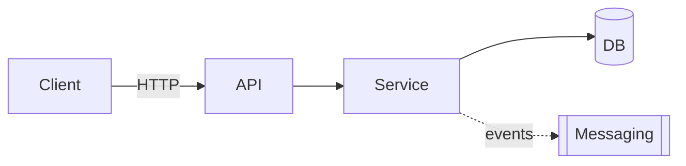

# Target Architecture

> Target architecture for the new system, respecting the paradigm chosen in `paradigm_decision.md` and the strategy confirmed in `migration_strategy.md`.

## Overview

## Diagram (Mermaid)

## Components

| Component | Type | Responsibility | Origin (legacy / new / merged) |
|---|---|---|---|
| <name> | API / Service / Worker / DB / Queue | <text> | <ref to legacy or "new"> |

## Bounded contexts

### BC-01: <name>
- **Responsibility**: <text>
- **Justification for grouping / separation**: <why this context was not decomposed 1-to-1 from legacy>
- **Internal components**: <list>
- **Published events** (if paradigm is event-driven): <list>
- **Consumed events**: <list>

<repetir por contexto>

## Architectural decisions (ADR-style summary)

### AD-01: <title>
- **Decision**: <text>
- **Alternatives discarded**: <list>
- **Justification**: <text, linking paradigm, strategy, and appetite>
- **Traceability**: <reference to legacy or to discard_log>

## Honoring the chosen paradigm

> Mandatory section when there is a paradigm shift. Demonstrates that the architecture honors the decision in `paradigm_decision.md`.

- **Target paradigm**: <from `paradigm_decision.md`>
- **How the architecture honors this paradigm**:
  - <e.g., event-driven → explicit events, message schemas, eventual consistency strategy>
  - <e.g., OO with DI → interfaces, injection container, clear boundaries between layers>
  - <e.g., functional → immutable types, composition, absence of side effects in domain>

## Boundaries with legacy during migration
- <e.g., during Strangler Fig, the new API reroutes calls from legacy X until phase Y>

## Notes
<Additional design observations.>
